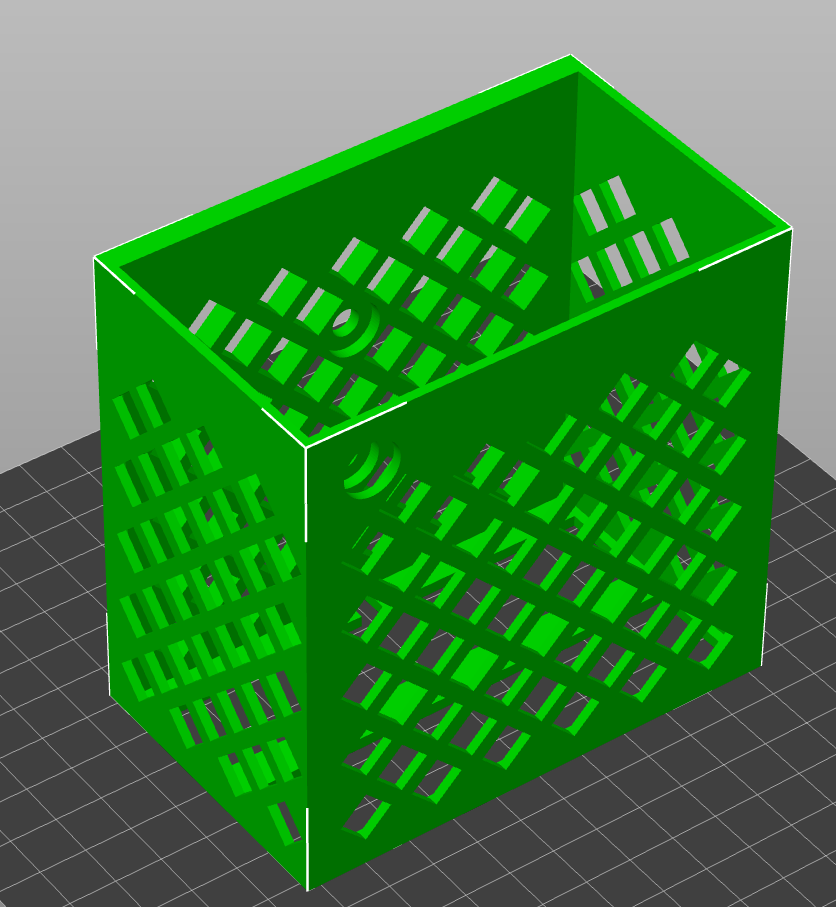
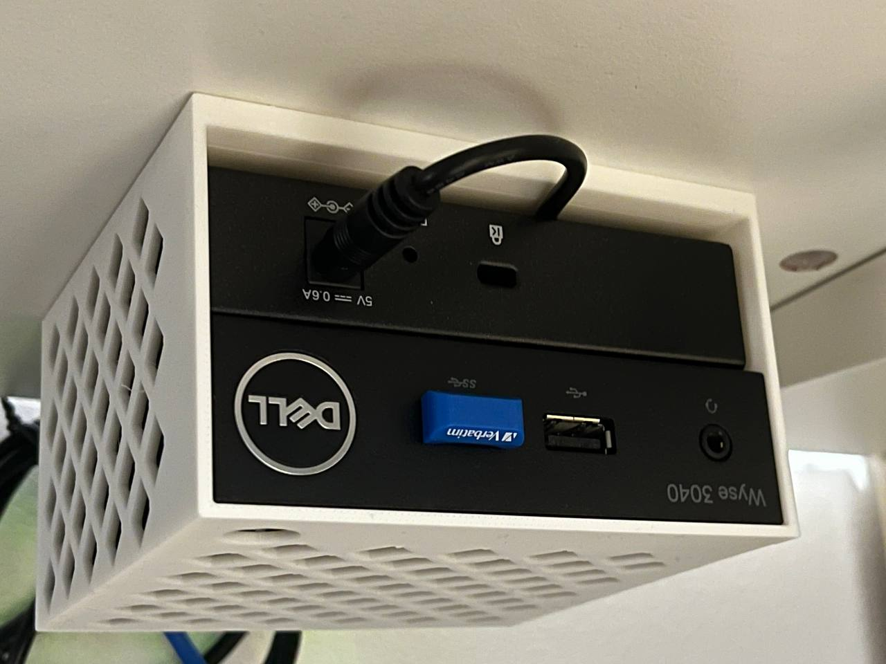
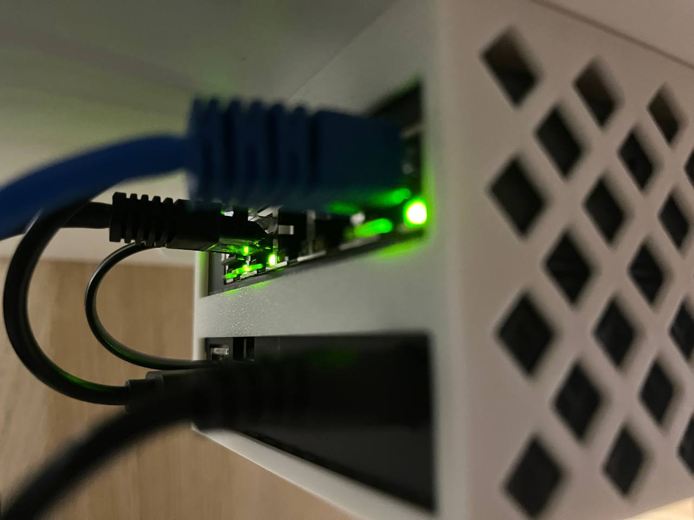

# AtomIDS Desk Mount

Here are models suitable for 3D printing of holder for both Dell Wyse 3040 and TP Link TL-SG105E. There are STL and also 3MF files for your 3D printer software, and also OpenSCAD script used to generate the STL file.

The holder is designed to fit exactly the holes in the [IKEA Trotten Desk sit/stand, 160x80 cm](https://www.ikea.com/cz/en/p/trotten-desk-sit-stand-white-s79429602/). There are two positions how the desk adjustment mechanism can be assembled (on the right or left). Then there are spare holes under the back side of the desk, and this 3D model fits exactly those screw holes.

